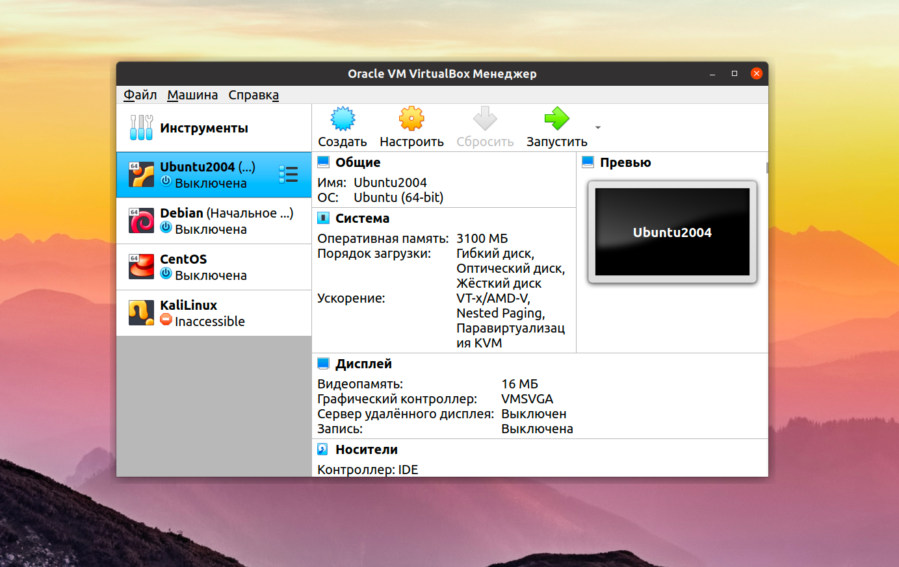
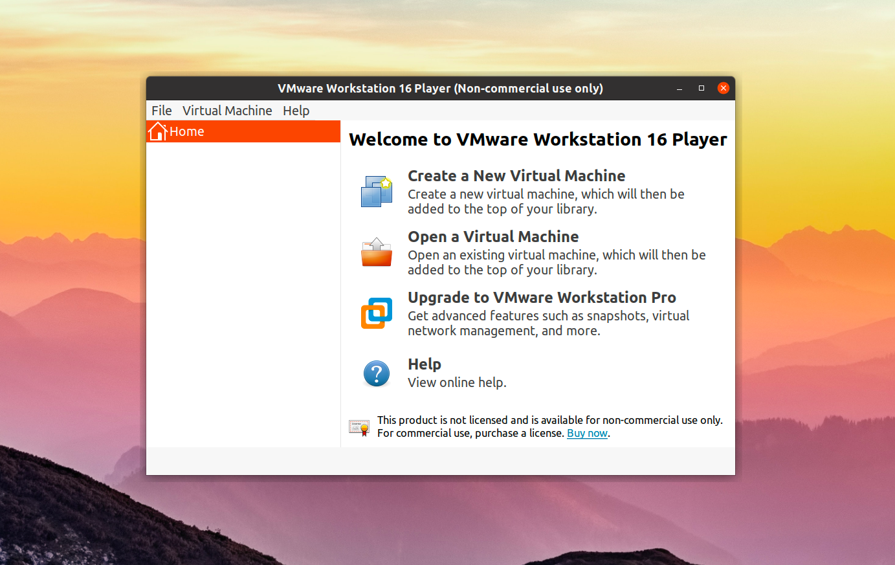
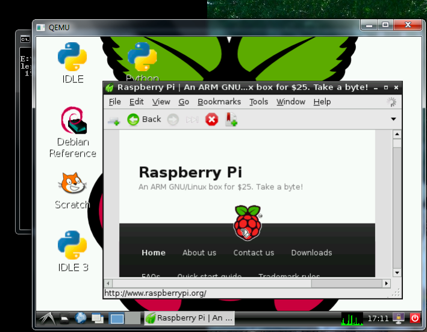

Виртуальная машина (ВМ) — это виртуальный компьютер со всеми виртуальными устройствами и виртуальным жёстким 
диском, на который и устанавливается новая независимая ОС (гостевая ОС) вместе с виртуальными драйверами устройств, 
управлением памятью и другими компонентами. Т. е. мы получаем абстракцию физического оборудования, позволяющую 
запускать на одном компьютере множество виртуальных компьютеров. Виртуальное оборудование отображается в свойствах 
системы, а установленные приложения взаимодействуют с ним как с настоящим. При этом сама виртуальная машина 
полностью изолирована от реального компьютера, хотя и может иметь доступ к его диску и периферийным устройствам.

## Когда использовать ВМ

Стоит выбрать ВМ при необходимости виртуализации системы с гарантированно выделенными ресурсами и виртуальным 
аппаратным обеспечение, когда нужно проверить работоспособность на разных ОС. 

Что даёт использование ВМ:

- возможность установки на одном компьютере нескольких различных ОС;
- распределение системных ресурсов между виртуальными машинами;
- отсутствие необходимости перезагрузки для переключения между операционными системами;
- возможность сделать «снимок» текущего состояния системы и содержимого дисков для возвращения системы в исходное состояние;
- изоляция неисправностей и нарушений системы безопасности на аппаратном уровне;
- возможность моделирования вычислительной сети на одном компьютере.

## Популярные ВМ

1. VirtualBox

    VirtualBox поддерживает как 32, так и 64 битные системы и вы можете установить не только Linux дистрибутив, 
    но и Windows или даже MacOS.
    
    
    
    Кроме непосредственно виртуализации, VirtualBox поддерживает и дополнительные функции, например, запись видео 
    с экрана виртуальной машины, и создание снимков системы для быстрого восстановления и создание виртуальной сети 
    между несколькими машинами. Кроме того, если установить дополнения гостевой ОС, то можно настроить общий буфер 
    обмена между хостовой и гостевой системой, передавать между ними файлы или даже интегрировать окна программ гостевой 
    системы в основную.

2. VMware

    В отличие от VirtualBox, которая распространяется с открытым исходным кодом, это коммерческий продукт, то есть платный.
    
    VMWare имеет почти те же возможности, что и VirtualBox, в некоторых тестах она показывает себя лучше, чем первый 
    вариант, но в целом их производительность одинакова. Тоже есть возможность организовывать сеть между виртуальными 
    машинами, объединять буфер обмена и передавать файлы, но нет записи видео.

    

3. Qemu

    Qemu - это сокращение от Quick Emulator. Это очень простая в настройке консольная утилита, но позволяет делать 
    многие интересные вещи на уровне VirtualBox, вы можете запускать любые операционные системы, в том числе и ARM, 
    можете установить ОС на реальный жесткий диск или в файл, использовать аппаратное ускорение и даже автоматически 
    скачивать некоторые дистрибутивы через интернет.
    
    

## ВМ vs Docker

На изображении выше можно видеть, что каждая виртуальная машина имеет свою гостевую операционную систему над 
основной операционной системой, что делает виртуальные машины тяжелыми. С другой стороны, контейнеры Docker
используют общую операционную систему хоста, и поэтому они легковесны. Совместное использование операционной 
системы хоста между контейнерами делает их очень легкими и помогает им загружаться всего за несколько секунд. 
Следовательно, накладные расходы на управление контейнерной системой очень низкие по сравнению с виртуальными машинами.

## Источники

1. [https://habr.com/ru/post/474068/](https://habr.com/ru/post/474068/)
2. [https://wiki.merionet.ru/servernye-resheniya/35/chem-docker-on-otlichaetsya-ot-virtualnoj-mashiny/](https://wiki.merionet.ru/servernye-resheniya/35/chem-docker-on-otlichaetsya-ot-virtualnoj-mashiny/)