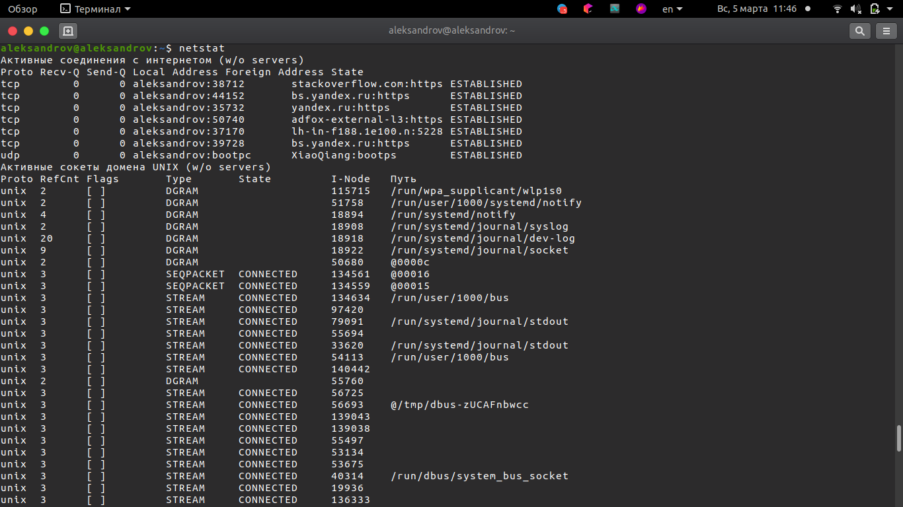
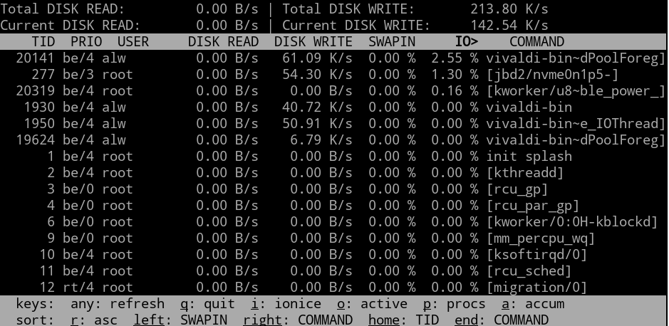

# netstat

Утилита netstat предназначена для получения сведений о состоянии сетевых соединений и слушаемых на данном компьютере
портах TCP и UDP, а также, для отображения статистических данных по сетевым интерфейсам и протоколам.

Формат командной строки:

```shell
netstat [-a] [-b] [-e] [-f] [-n] [-o] [-p протокол] [-r] [-s] [-t] [интервал]
```

Параметры командной строки:

- `-a` - Отображение всех подключений и ожидающих портов.
- `-b` - Отображение исполняемого файла, участвующего в создании каждого подключения, или ожидающего порта. 
Иногда известные исполняемые файлы содержат множественные независимые компоненты. Тогда отображается 
последовательность компонентов, участвующих в создании подключения, либо ожидающий порт. В этом случае имя 
исполняемого файла находится снизу в скобках [], сверху - компонент, который им вызывается, и так до тех пор, 
пока не достигается TCP/IP. Заметьте, что такой подход может занять много времени и требует достаточных разрешений.
- `-e` - Отображение статистики Ethernet. Может применяться вместе с параметром -s.
- `-f` - Отображение полного имени домена (FQDN) для внешних адресов.
- `-n` - Отображение адресов и номеров портов в числовом формате.
- `-o` - Отображение кода (ID) процесса каждого подключения.
- `-p` протокол - Отображение подключений для протокола, задаваемых этим параметром. Допустимые значения: TCP, UDP, 
TCPv6 или UDPv6. Используется вместе с параметром -s для отображения статистики по протоколам. Допустимые значения: 
IP, IPv6, ICMP, ICMPv6, TCP, TCPv6, UDP или UDPv6.
- `-r` - Отображение содержимого таблицы маршрутов.
- `-s` - Отображение статистики протокола. По умолчанию статистика отображается для протоколов IP, IPv6, ICMP, ICMPv6, \
TCP, TCPv6, UDP и UDPv6. Параметр -p позволяет указать подмножество выводимых данных.
- `-t` - Отображение текущего подключения в состоянии переноса нагрузки с процессора на сетевой адаптер при передаче 
данных ( "offload" ).
- `-v` - подробный вывод информации, если это возможно.
- `интервал` - Повторный вывод статистических данных через указанный интервал в секундах. Для прекращения вывода данных 
нажмите клавиши CTRL+C. Если параметр не задан, сведения о текущей конфигурации выводятся один раз.

Пример отображаемой информации:



Активные соединения с Интернетом возникают, когда, к примеру, запускается браузер, открывается какой-либо сайт.

`Proto` - название протокола.<br>
`Local` - локальный IP-адрес участвующий в соединении или связанный со службой.<br>
`Foreign address` Внешний IP-адрес, участвующий в создании соединения.<br>
`State` - состояние соединения. Возможные состояния:
- CLOSE_WAIT - ожидание закрытия соединения.
- CLOSED - соединение закрыто.
- ESTABLISHED - соединение установлено.
- LISTENING - ожидается соединение (слушается порт)
- TIME_WAIT - превышение времени ответа.


Сокет - это абстракция сетевого взаимодействия в операционной системе Linux. Каждому сокету соответствует 
пара IP-адрес + номер порта.

## Источники

0. [https://ab57.ru/cmdlist/netstat.html](https://ab57.ru/cmdlist/netstat.html)
1. [https://habr.com/ru/company/otus/blog/539550/](https://habr.com/ru/company/otus/blog/539550/)


# nc (netcat)

`netcat` — утилита Unix, позволяющая устанавливать соединения TCP и UDP, принимать оттуда данные и передавать их.

## Синтаксис и опции

```shell
nc -параметры адрес порт(ы)
```

Часть параметров указывается с уточняющими значениями, а часть без них. Вот список наиболее востребованных параметров:

- `-6` – использовать протокол IPv6. По умолчанию используется параметр -4 и IPv4 соответственно;
- `-h` – вывести справку со списком доступных параметров;
- `-i задержка` – добавить задержку между отправкой строк или сканированием портов. Задаётся в секундах;
- `-l` – режим прослушивания. Используется с указанием порта;
- `-N` – закрыть соединение при достижении конца файла при его отправке;
- `-n` – Работать с IP-адресами напрямую, не задействуя DNS, также отключить поиск портов;
- `-P` имя_пользователя – указать имя пользователя для подключения к прокси;
- `-x адрес:порт` – указать адрес и порт для подключения к прокси;
- `-p порт` – указать номер порта. В большинстве случаев порт считывается без указания параметра;
- `-U` – использовать сокет домена UNIX (для межпроцессного взаимодействия);
- `-u` – использовать протокол UDP, по умолчанию используется TСP;
- `-v` – подробный режим. Используется при сканировании портов;
- `-W` количество_пакетов – закрыть соединение после получения определённого количества пакетов;
- `-w таймер` – включить таймер для ограничения времени соединения. Задаётся в секундах;
- `-z` – отключить отправку данных. Используется при сканировании портов.

## Примеры использования nc

### Проверка порта

```shell
nc -vz 192.168.31.247 8080
```

### Прослушивание порта

```shell
nc -nlv 8080
```

### Чат и обмен файлами

Для того чтобы запустить чат на одном компьютере запускаем утилиту в режиме прослушивания порта:

```shell
nc -lp 8080
```

На другом компьютере потребуется указать адрес первого компьютера и тот же самый порт. Также не забудьте проверить, что порт открыт:

```shell
nc 0.0.0.0 8080
```

## Источники

0. [https://manpages.ubuntu.com/manpages/bionic/man1/nc_openbsd.1.html](https://manpages.ubuntu.com/manpages/bionic/man1/nc_openbsd.1.html)
1. [https://losst.pro/komanda-nc-v-linux](https://losst.pro/komanda-nc-v-linux)


# top

top (table of processes) — консольная команда, которая выводит список работающих в системе процессов и информацию о них.

## Опции и команды top

Основные опции:

- `-v` - вывести версию программы;
- `-b` - режим только для вывода данных, программа не воспринимает интерактивных команд и выполняется пока не будет завершена вручную;
- `-c` - отображать полный путь к исполняемым файлам команд;
- `-d` - интервал обновления информации;
- `-H` - включает вывод потоков процессов;
- `-i` - не отображать процессы, которые не используют ресурсы процессора;
- `-n` - количество циклов обновления данных, после которых надо закрыть программу;
- `-o` - поле, по которому надо выполнять сортировку;
- `-O` - вывести все доступные поля для сортировки;
- `-p` - отслеживать только указанные по PID процессы, можно указать несколько PID;
- `-u` - выводить только процессы, запущенные от имени указанного пользователя.

## Интерактивные команды

- `h` - вывод справки по утилите;
- `q` или Esc - выход из top;
- `A` - выбор цветовой схемы;
- `d или s` - изменить интервал обновления информации;
- `H` - выводить потоки процессов;
- `k` - послать сигнал завершения процессу;
- `W` - записать текущие настройки программы в конфигурационный файл;
- `Y` - посмотреть дополнительные сведения о процессе, открытые файлы, порты, логи и т д;
- `Z` - изменить цветовую схему;
- `l` - скрыть или вывести информацию о средней нагрузке на систему;
- `m` - выключить или переключить режим отображения информации о памяти;
- `x` - выделять жирным колонку, по которой выполняется сортировка;
- `y` - выделять жирным процессы, которые выполняются в данный момент;
- `z` - переключение между цветным и одноцветным режимами;
- `c` - переключение режима вывода команды, доступен полный путь и только команда;
- `F` - настройка полей с информацией о процессах;
- `o` - фильтрация процессов по произвольному условию;
- `u` - фильтрация процессов по имени пользователя;
- `V` - отображение процессов в виде дерева;
- `i` - переключение режима отображения процессов, которые сейчас не используют ресурсы процессора;
- `n` - максимальное количество процессов, для отображения в программе;
- `L` - поиск по слову;
- `<>` - перемещение поля сортировки вправо и влево;

## Запуск

```shell
top 
```

## Колонки

Программа с частотой обновления в 2с показывает текущую активность процессов в виде таблицы. Стандартные колонки:

- `PID` — идентификатор процесса
- `USERNAME` — пользователь, от которого запущен процесс
- `THR` — количество потоков, запущенных процессом
- `PR` — текущий приоритет процесса
- `NICE` — приоритет, выставленный командой nice. От −20 (наивысший) до 19.
- `SIZE` — размер процесса (данные, стек и т. д.) в килобайтах
- `RES` — текущее использование оперативной памяти
- `STATE` — текущее состояние («START», «RUN» (только в этом состоянии показывает текущую нагрузку программы на процессор), «SLEEP», «STOP», «ZOMB», «WAIT» или «LOCK»)
- `C` — номер процессора, на котором идет выполнение (доступен только на SMP системах)
- `TIME` — время использования процессора в секундах
- `VIRT` — полный объем виртуальной памяти, которую занимает процесс
- `%CPU` — процент доступного времени процессора, которое использовала запущенная программа
- `%MEM` — процент использования оперативной памяти данным процессом
- `WCPU` — усредненное значение CPU
- `COMMAND` — команда, запустившая процесс.

## Фильтрация

Чтобы отфильтровать процессы, запущенные от имени определённого пользователя используйте команду u:

```shell
u
```

После ввода команды она попросит ввести имя пользователя или его UID.

Также можно фильтровать процессы по любому другому полю. Для этого нажмите клавишу o, затем введите условие фильтра в виде `ИМЯ_ПОЛЯ=значение`.

Например:

```shell
USER=syslog
```

## Завершение процессов

Чтобы завершить процесс, используйте команду k.

## Источники

1. [https://losst.pro/komanda-top-v-linux](https://losst.pro/komanda-top-v-linux)
2. [https://ru.wikipedia.org/wiki/Top](https://ru.wikipedia.org/wiki/Top)


# iotop

iotop — это утилита для мониторинга активности диска на базе ОС Linux. Она дает анализ в реальном времени и 
использование диска операционной системой. Она получает доступ ко всей информации, связанной с использованием диска, 
напрямую из ядра Linux. Это делает систему более надежной с точки зрения точности, поскольку все извлекаемые данные 
будут в реальном времени.

Она основан на многопоточной модели. Она предоставляет информацию о каждом потоке, участвующем в операциях ввода-вывода, 
а также об их использовании полосы пропускания.

Запускается iotop только c админскими права:

```shell
sudo iotop
```

Внешний вид утилиты:



Рассмотрим отображающие информацию поля:

- `Total DISK READ / DISK WRITE` — общая статистика по вводу выводу.
- `Current DISK READ / DISK WRITE` — текущая статистика обращения к дискам, не учитывается cache и buffur, не учитываются операции ввода вывода внутри ядра.
- `TID` — номер потока.
- `PRIO` — приоритет.
- `USER` — имя пользователя.
- `DISK READ / DISK WRITE` — блоков считывается / записывается в секунду.
- `SWAPIN` — процент времени потраченный на помещение данных в подкачку.
- `IO` — процент времени ожидания ввода вывода.
- `COMMAND` — имя команды запустившей процесс.


## Работа с iotop

Чтобы отображать только активные процессы, которые выполняют дисковые операции, необходимо нажать клавишу `O` или
запустить утилиту с ключом `-o`:

```shell
sudo iotop -o
```


## Источники

1. [https://sysadminium.ru/adm-serv-linux-iotop-ionice-utils/](https://sysadminium.ru/adm-serv-linux-iotop-ionice-utils/)
2. [https://habr.com/ru/company/ruvds/blog/527238/](https://habr.com/ru/company/ruvds/blog/527238/)